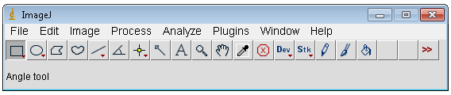
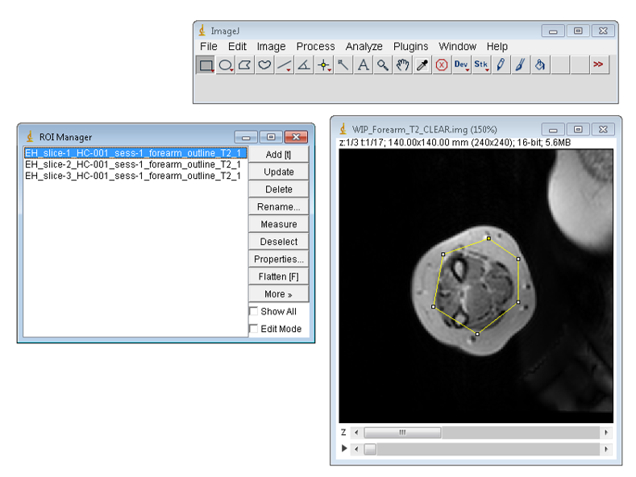
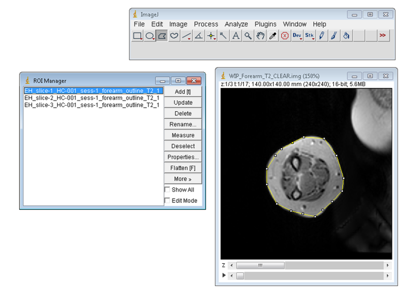

Analyzing Data in the Study Structure
=====================================

Copying image data into the study directory structure
-----------------------------------------------------

To start with, copy the image data into the testStudy data directory.
The image data is in ANALYZE format and can be found in the
**simplemodelData** directory. It needs to be copied into the
T\ :sub:`2` directory, see the tree structure above. The two image files
are

| WIP_Forearm_T2_CLEAR.hdr
| WIP_Forearm_T2_CLEAR.img

Modifying the ROI files for the data
------------------------------------

ROI template files were created automatically in the previous section.
They now need to be edited using imageJ to correspond correctly to the
data in the image file. An example is shown in Figure 1 below. The ROI
file is loaded into imageJ by dragging the zip file on to the toolbar of
the imageJ main window.

|ImageJ main window|

Figure 1 Drag files onto this window to load them into imageJ

The image is loaded in a similar manner, drag the hdr or img file onto
the toolbar of the main imageJ window. The image needs to be flipped in
the vertical direction as in Figure 2, before editing the ROIs.

|Flip the image|

Figure 2 Flip vertically the data set before working with the ROIs

In Figure 3, the images have been flipped and the ROI file for the
outlines have been loaded. One can see on the image the outline of the
template ROI that will be edited. The ROI is edited by clicking the
polygon button in the main imageJ window. Then clicking outside the
template ROI and then clicking again at the position where you want to
start drawing the ROI

|Template outline ROI ready to be edited|

Figure 3 Outline template ROI prior to setting the polygon button and
editing

Upon completion of the drawing of the ROI the update button is pressed
in the ROI manager window to save the modifications. An example of a
edited ROI is shown in Figure 4. When all ROIs have been drawn, making
sure to increment the slice to correspond with the ROI name, all the
ROIs are highlighted in the ROI manager window and the **more** button
is clicked and then the **save** button. The user should then overwrite
the corresponding zip ROI file.

|Modified ROI ready to be updated|

Figure 4 Newly drawn ROI ouline the muscle and fat of the forearm

The rois for the fat are best drawn using the rectangle tool in imageJ.
Figure 5 shows the fat ROIs about to be saved after they have been
edited

|Fat Rois|

Figure 5 Fat ROIs using rectangle tool ready to be saved

.. |Flip the image| image:: images/ch4/media/image2.png
   :width: 5.83333in
   :height: 7.28056in

.. |Fat Rois| image:: images/ch4/media/image5.png
   :width: 5.83333in
   :height: 4.27431in
